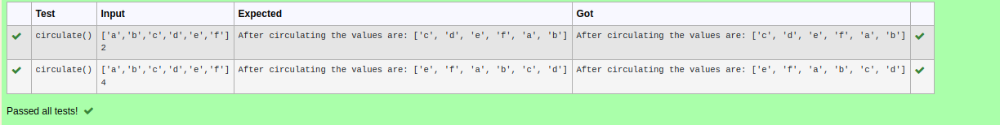

# Circulate-the-values-of-N-variables
## Aim:
To write a python program to circulate the n variables using function concept
## Equipment’s required:
PC
Anaconda - Python 3.7
## Algorithm: 
### Step 1: 
### Step 2: 
### Step 3: 
Get the value from the user for the number of rotation
### Step 4: 
Using the slicing concept rotate the list

### Step 5: 
### Step 6: 
## Program:
a=eval(input())

b=eval(input())

def circulate():

    for n in range(b+1):

        c=a[n:]+a[:n]

    return c
    
print("After circulating the values are:",circulate())

## Output:

## Result:
Thus the circulate of n variables of n variables succesfully executed.